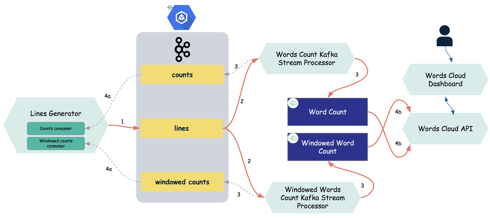

# Overview

This workshop is a word cloud application. The application uses Kafka to receive text from external sources.
The word cloud application shows the data in two forms - real-time and historical.
The real-time dashboard shows top words by that are currently active.
The historical dashboard shows top words in last 30 min, 60 min, and so on.
The dashboard needs great user experience where speed of data access and data aggregations becomes important.
For this purpose we will use Gemfire/PCC distributed in-memory data grid.
The streaming applications consuming from Kafka topic use Kafka's native streaming API built on top of
Spring Cloud Stream binders.

Here is the topology of the application


## Key components

### Kafka topics
1. Lines - unprocessed text
1. Counts - aggregate word count
1. Windowed counts - word count based on a tumbling window

### Apps
1. [Cache Server](./cache-server) - creates a cache server instance to load/store word count and windowed word count stream data. 
1. [Lines Generator](./lines-generator) - sends random text lines to “lines” topic, reads data from “counts” topic, reads data from “windowed counts” topic
1. [Word Count Stream](./wordcount-stream) - Uses Kstream to read from “lines” topic, performs stateful transformations i.e. count words, send output to “counts” topic on Kafka and stores the output in a PCC region “Words_Count”
1. [Windowed Word Count Stream](./windowed-wordcount-stream) - Uses Kstream to read from “lines” topic, performs stateful transformations using tumbling window i.e. windowed count words, send output to “windowed counts” topic on Kafka and stores the output in a PCC region “Words_Count_Windowed”
1. [Web UI](./web-ui) - UI dashboard that uses Word cloud API

### Gemfire/PCC regions
1. Words_Count - partitioned cache designed to hold real-time aggregate word count, evicts word entries if no write/update in 60 sec
1. Words_Count_Windowed - partitioned cache with LRU based eviction policy designed to hold windowed word count, eviction triggered at 70% heap usage

## Steps to start the apps
For Kafka we will use docker-compose to start a dockerized Kafka on your laptop.
We have included the the required files in [kafka-local](./kafka-local) folder in this repo.
Of course, you will need to have Docker already installed on your laptop.
We also have included instructions to setup Kafka on a Kubernetes cluster using Helm charts.

The rest of the demo components are spring boot apps that can be run locally.

#### Git clone this repo
```
cd pivotal-confluent-demo
```

#### Setup local kafka
```
cd kafka-local
./stop-docker.sh
docker-compose up -d
```
#### Start gemfire cache server instance [cache-server](cache-server)
```
cd cache-server
./mvnw clean package
java -jar target/cache-server-1.0.jar
```
#### Start [lines-generator](lines-generator) app, either from your favorite IDE or
```
cd lines-generator
./mvnw clean package
java -jar target/lines-generator-1.0.jar
```

#### Start [words count stream](wordcount-stream) app, either from your favorite IDE or
```
cd wordcount-stream
./mvnw clean package
java -jar target/wordcount-stream-1.0.jar
```

#### Start [windowed words count stream](windowed-wordcount-stream) app, either from your favorite IDE or
```
cd windowed-wordcount-stream
./mvnw clean package
java -jar target/windowed-wordcount-stream-1.0.jar
```

#### Start the [web UI](web-api) app, either from your favorite IDE or
```
cd web-ui
./mvnw clean package
java -jar target/web-ui-1.0.jar
```

#### API Endpoints
1. [List all Words / Counts](http://localhost:8084)
1. [Windowed Word / Count] - TODO
1. Get Wordcount for Start/End Time - TODO
